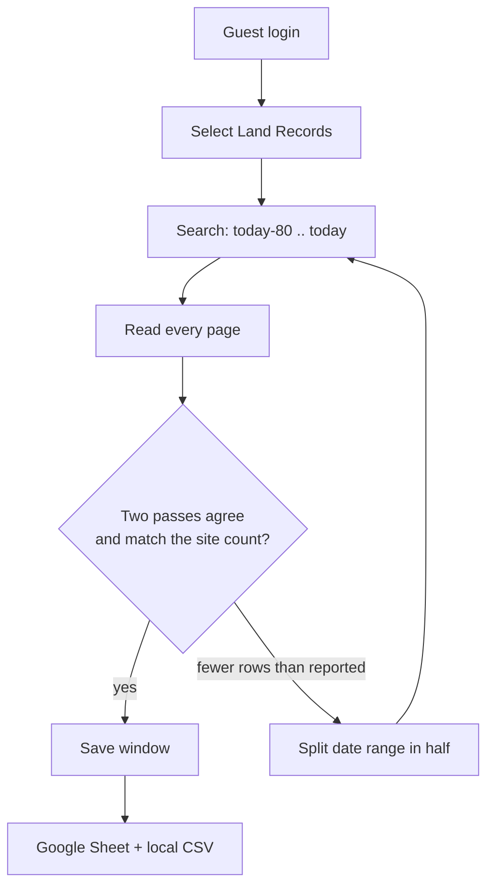

<h1 align="center">SearchIQS Ashford Land Records Scraper</h1>

<p align="center">
  The last 80 days of Ashford, CT land records, pulled from the SearchIQS guest search into a Google Sheet.<br>
  Plain HTTP only. No Selenium, Playwright, or any other browser automation.
</p>

<p align="center">
  
  
</p>

<p align="center">
  <a href="https://docs.google.com/spreadsheets/d/1dziNZ9wpM47Jsab3-ewzqmpvYxeMr5ged-mx197zlE4/edit?usp=sharing"><b>Sample Sheet</b></a>
  &nbsp;·&nbsp; <a href="#quick-start">Quick start</a>
  &nbsp;·&nbsp; <a href="#how-it-works">How it works</a>
  &nbsp;·&nbsp; <a href="#status-and-limitations">Status</a>
</p>

---

## Sample output

**[Open the sample Google Sheet (read-only)](https://docs.google.com/spreadsheets/d/1dziNZ9wpM47Jsab3-ewzqmpvYxeMr5ged-mx197zlE4/edit?usp=sharing)**

159 Land Records recorded 07/08/2026 to 09/26/2026, from 2 result pages. That's exactly the site's own
"159 documents found", with 159 distinct record IDs and no row issues. See [Status and limitations](#status-and-limitations)
for how this sample was produced.

Columns: `Party 1` · `Party 2` · `Type` · `Book-Page` · `Date` · `Description` · `Additional Description` ·
`Related` · `Doc ID` · `Issues`

## What the task asked for, and how it's done

| Requirement | How |
|---|---|
| Search Records as Guest | Replays the `btnGuestLogin` postback and follows the redirect to the search form |
| Document Group = Land Records | Posts the `cboDocGroup=LR` AutoPostBack, then checks the selection stuck |
| From = today - 80 days, To = today | Computed at run start in America/New_York, never hard-coded |
| All results and pages | Follows **Next** until the last page; page numbers, totals and the search criteria are checked on every page |
| The 8 fields | Parsed from the result grid by column header; party lists cross-checked with the site's full tooltip |
| Export to a Google Sheet | `Records` and `Run Info` tabs, written as plain text and read back to verify |
| Python, no browser automation | `curl_cffi` + BeautifulSoup + `lxml`; see `requirements.txt` |
| US VPN | Every run checks that traffic leaves from a US address, and stops if not |

## Quick start

```bash
git clone https://github.com/CoffeeAurCode/SearchIQS-Ashford_Scraper.git
cd SearchIQS-Ashford_Scraper
python -m venv .venv
.venv\Scripts\activate            # macOS/Linux: source .venv/bin/activate
pip install -r requirements.txt
copy .env.example .env            # macOS/Linux: cp .env.example .env
```

Fill in `.env` (see [Setup](#setup)), connect a US VPN, then:

```bash
python -m searchiqs_scraper --check-access    # is the VPN and the Cloudflare cookie good?
python -m searchiqs_scraper                   # scrape, then publish to your Google Sheet
```

## How it works



- **Each search is done twice**, in separate sessions. A window only counts as COMPLETE when both passes return the
  same total and the same rows, and the row count matches the site's "N documents found".
- If the site returns fewer rows than it reports (a result cap) or the page limit is hit, the date range is split in
  half and each half is fetched on its own.
- Every finished window is saved to disk atomically, so an interrupted run resumes where it stopped instead of
  starting over.

The whole flow is the site's own ASP.NET WebForms posts (view state, event targets, AutoPostBack), replayed with
`curl_cffi`.

## Setup

You need Python 3.11+, a **US VPN** (the site blocks other countries), and for the Sheets export a Google **service
account**. All settings go in `.env`, or in environment variables, which take precedence. `.env.example` lists every option.

<details>
<summary><b>Google Sheets</b></summary>

1. In [Google Cloud Console](https://console.cloud.google.com/), create a project, enable the **Google Sheets API**,
   create a **service account**, and download a JSON key.
2. Save the key as `credentials/service-account.json` (git-ignored).
3. Create a Google Sheet and **Share** it with the service account's email (`...@...iam.gserviceaccount.com`) as
   **Editor**. For a public read-only link, set General access to **Anyone with the link: Viewer**.
4. In `.env`: `GOOGLE_SERVICE_ACCOUNT_FILE=credentials/service-account.json` and `GOOGLE_SHEET_ID=` the ID from the
   sheet URL (`https://docs.google.com/spreadsheets/d/<ID>/edit`).

</details>

<details>
<summary><b>Cloudflare cookie (each session)</b></summary>

The search pages sit behind a Cloudflare check that plain HTTP can't pass. You pass it once in a normal browser and
the scraper reuses the cookie. With the **VPN connected**:

1. In Chrome, open `https://www.searchiqs.com/CTASH/`, complete "Verify you are human" if shown, and click
   **Search Records as Guest**.
2. DevTools (F12) > Application > Cookies > `https://www.searchiqs.com`: copy the `cf_clearance` value into
   `SEARCHIQS_CF_CLEARANCE`.
3. In the DevTools Console, run `navigator.userAgent` and copy the result into `SEARCHIQS_USER_AGENT`.

The cookie is tied to your IP address and User-Agent, so run the scraper on the same machine and VPN connection.
`SEARCHIQS_IP_FAMILY` (`auto`, `4`, `6`) pins IPv4 or IPv6; `--check-access` reports which one works. If your
antivirus intercepts HTTPS, point `SEARCHIQS_CA_BUNDLE` at a PEM bundle that includes its root certificate.

</details>

## Commands

```bash
python -m searchiqs_scraper                      # scrape and publish
python -m searchiqs_scraper --local-only         # scrape only: output/<run id>/export/records.csv
python -m searchiqs_scraper --resume RUN_ID      # continue an interrupted run (same date range)
python -m searchiqs_scraper --export-only RUN_ID # (re)publish a finished local run
python -m searchiqs_scraper --check-access       # VPN + cookie check, 3 requests per address family
python -m searchiqs_scraper --help
```

| Exit code | Meaning |
|---|---|
| 0 | COMPLETE (and published, unless `--local-only`) |
| 2 | INCOMPLETE (data kept, gaps listed), or publishing failed after a good scrape |
| 1 | FAILED: no access, bad configuration, or a fatal error |

An INCOMPLETE run is only published with `--publish-incomplete`. If the cookie expires mid-run, the run stops cleanly:
refresh it and `--resume`.

**Output details.** Multiple parties are joined with `; ` in the site's order. `Related` keeps the link labels (like
`BK: 12 PG:345`). Everything is written as plain text, so `007` stays `007`. `Issues` names anything the scraper
couldn't verify for that row; empty means clean. A cell too long for Google Sheets continues in an `Overflow` tab.

## Tests

```bash
pip install -r requirements-dev.txt
python -m pytest -q
```

224 tests, fully offline. They run against a synthetic fake of the site (built from its observed page structure) and a
fake Sheets backend. Covered: guest flow, pagination, parsing, two-pass verification, cap splitting, crash-safe resume,
and publishing.

## Status and limitations

- **Live verification:** on 2026-09-26/27 (US time), through a US VPN, the site flow in this package fetched the full
  range 07/08/2026–09/26/2026: **159 Land Records over 2 pages**, matching the site's own total, with no row issues.
  Two independent passes over a 1-day window agreed exactly, and an empty day was recognised as zero results.
- **Sample sheet:** built with this scraper's parser from the result pages captured during that live run. Later the
  same day, Cloudflare stopped accepting freshly issued cookies from the VPN addresses in use. A final end-to-end run
  with a live publish couldn't be completed before the deadline, so the Sheets export has been tested offline only.
- **Manual step:** each session needs a browser-issued Cloudflare cookie, because plain HTTP can't obtain one.
  Cookies lasted hours in testing, but the site decides, and it can refuse cookies from some VPN IPs.
- **What COMPLETE means:** two independent observations agreed with each other and with the site's count. It doesn't
  prove the source didn't change between or after them.

## License

Copyright (c) 2026 [CoffeeAurCode](https://github.com/CoffeeAurCode). Licensed under the
[PolyForm Noncommercial License 1.0.0](LICENSE).

- **Free for non-commercial use** (learning, research, personal projects), as long as you keep the
  `Required Notice` line from [LICENSE](LICENSE) and credit the author.
- **Commercial use needs a separate license.** Using this code, or work based on it, in a product, a paid service, or
  for a business requires a commercial license from the author. Reach out through
  [GitHub](https://github.com/CoffeeAurCode).
- **Reviewers of this submission** are additionally permitted to clone, install, run, and assess the code for the
  purpose of evaluating it.

<br>
<p align="right">
  <a href="https://github.com/CoffeeAurCode"></a><br>
  <sub>made by <a href="https://github.com/CoffeeAurCode">CoffeeAurCode</a></sub>
</p>
